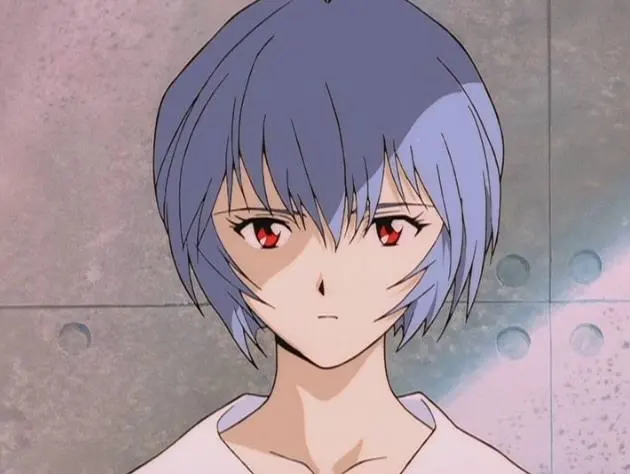
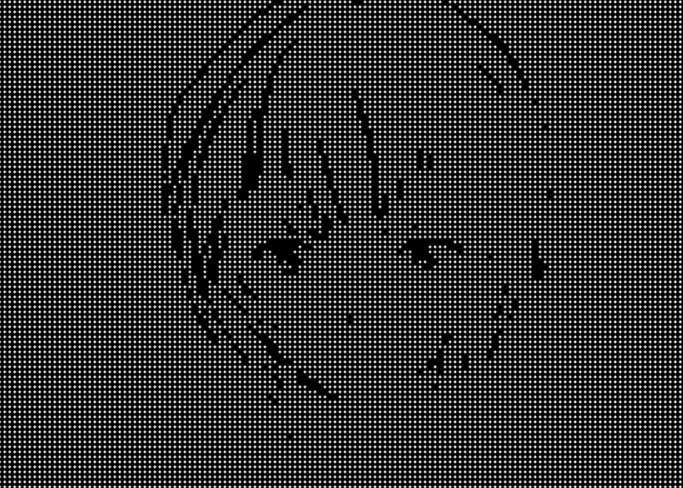

# ◉ Dot Art Maker

> Turn your photos into tiny little dots.
> **Black. White. Turtle. That's it.**

A small retro-style Python project that turns images into **dot art** using Turtle
## 🖼️ Before → After

| Before                               | After                             |
| ------------------------------------ | --------------------------------- |
|  |  |

## ✨ How It Works

1. Select an image from your computer.
2. The image is converted to grayscale.
3. The image is processed pixel by pixel.
4. Turtle draws the result using white dots on a black background.

For the best results, use a **black and white or high-contrast image**.

## 🚀 Run
Then run:

```bash
python dot_art_maker_gui.py
```

Select an image and the dot art process will start automatically.

## 📦 Requirements

* Python
* Pillow

## 🎨 About
**Made with Python + Pillow + Turtle.**
